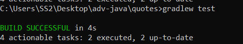
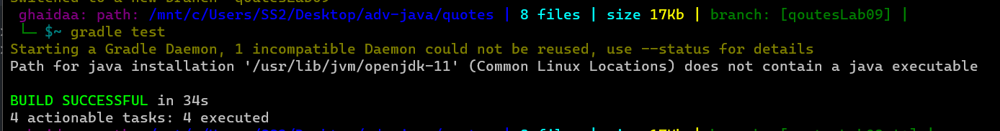

# QuotesLab

QuotesLab is a Java application that allows you to manage and display quotes from both local files and an external API. It provides functionalities to read quotes from files, retrieve quotes from an API, display random quotes, and save new quotes to a JSON file.

## Getting Started

To run this application, you'll need Java and Gradle installed on your system.

1. Clone this repository to your local machine.
2. Open a terminal and navigate to the project directory.
3. write on your cmd `gradlew test` if you want to test it.

## Usage

1. **Reading Quotes from Local File:**

    - The local quotes are stored in the file `app/src/main/resources/recentquotes.json`.
    - Run the application and it will read quotes from the local file, displaying a random quote along with its author and tags (if available).

2. **Reading Quotes from API:**

    - The application can also fetch quotes from an external API.
    - The API endpoint used in the example is `https://codefellows.github.io/code-401-java-guide/curriculum/class-08/recentquotes.json`.
    - The retrieved quote will be displayed along with its author and tags (if available). The quote will also be saved to the file `app/src/main/resources/RandomQ.json`.

## Code Overview

- `Qclass` class: Represents a quote object with author, text, and tags.
- `QuoteManager` class: Contains methods to manage quotes, including reading from files and APIs, displaying quotes, and saving quotes to JSON files.
- `App` class: Main class to run the application. It demonstrates reading quotes from both local files and APIs, displaying a random quote, and saving it to a JSON file.

### Testing output on CMD for Lab08

### Testing output on CMD for Lab09

